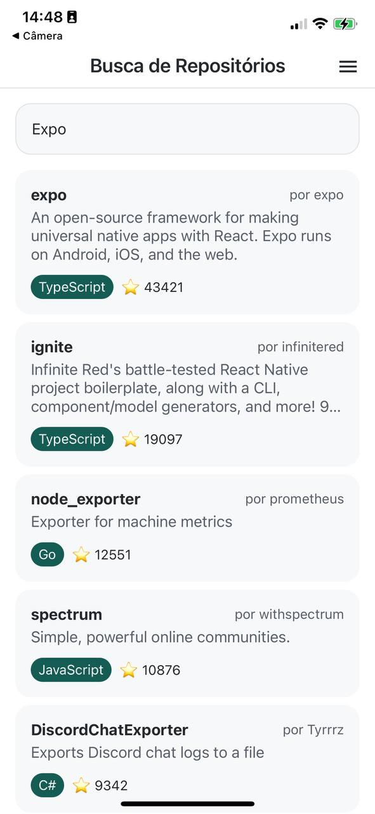
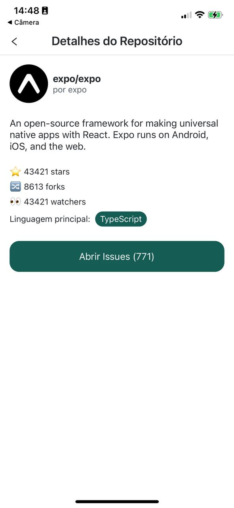
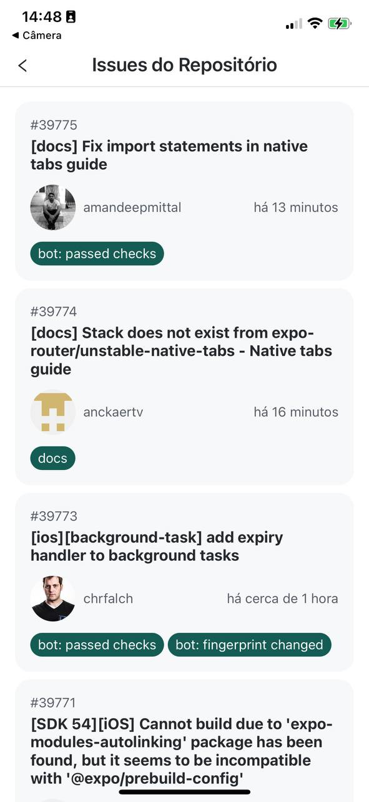
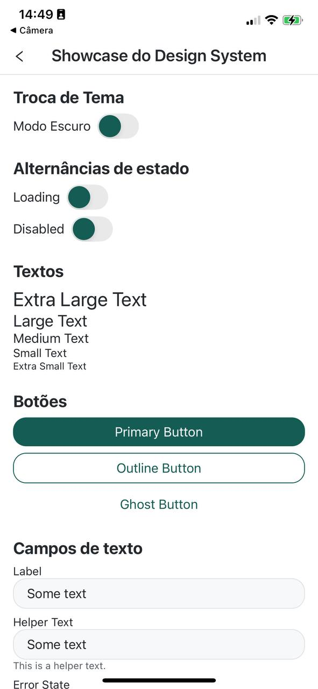
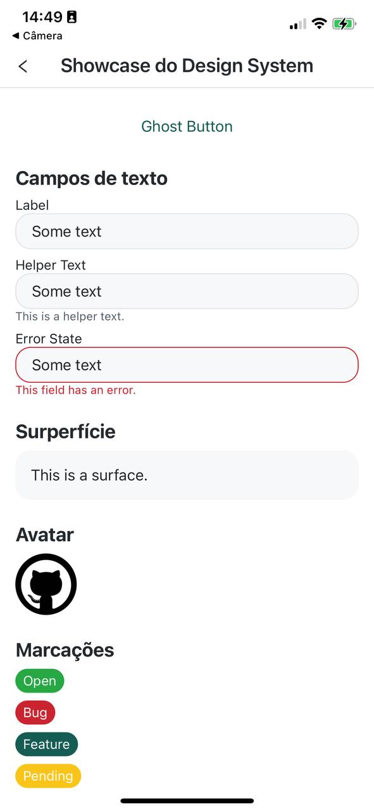
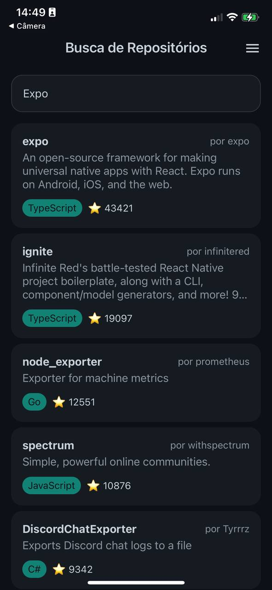
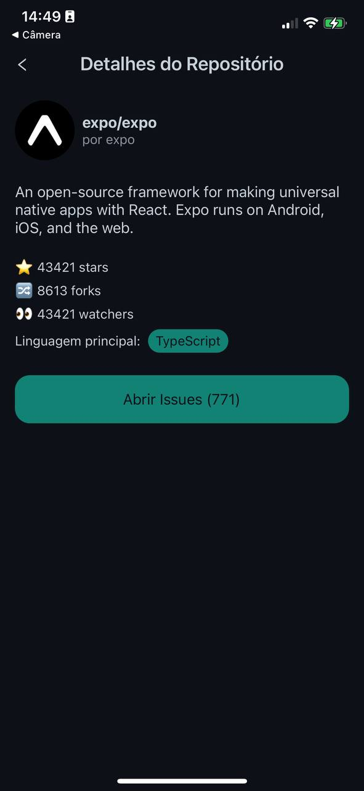
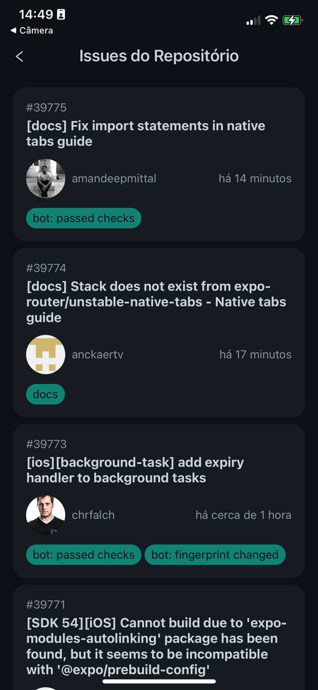
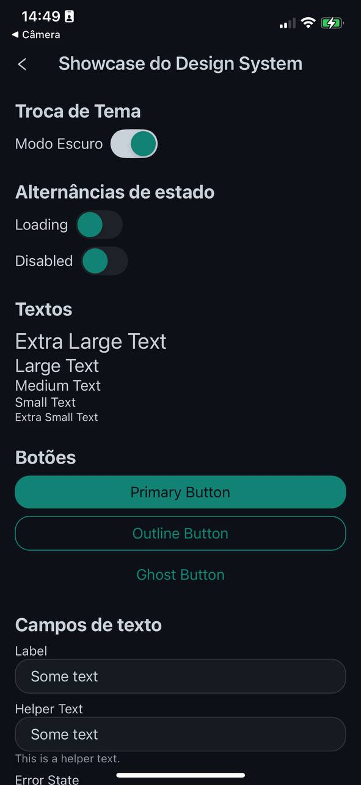
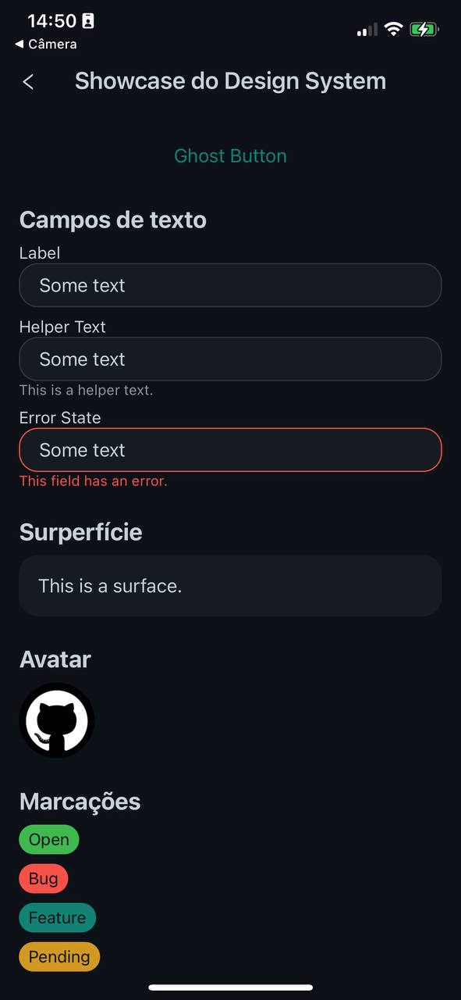

# Git Explorer App

Este é um aplicativo móvel para explorar repositórios do GitHub, construído com Expo e TypeScript.

## 🚀 Decisões Arquiteturais

A arquitetura do projeto é uma Arquitetura Híbrida (Features + Clean Architecture). A organização principal é por funcionalidade (/features) para maior agilidade e clareza, mas possui outras camadas (/core, /infrastructure) para o desacoplamento e facilidade de manutenção. Uma estrutura flexível e simples de entender para um projeto menor.

- **Design System**: Um Design System (/designSystem) dedicado para garantir consistência visual e um desenvolvimento mais rápido e com menos erros.

- **Framework**: O projeto utiliza **React Native** com o ecossistema **Expo**.

- **Linguagem**: **TypeScript** foi adotado para garantir a segurança de tipos (`type-safety`).

- **Gerenciamento de Estado do Servidor**: Para o fetching, caching e sincronização de dados com a API do GitHub, foi utilizado o **TanStack Query (React Query)**. Ele oferece uma solução robusta para lidar com estado assíncrono, otimizando o desempenho com features como cache, _refetching_ em background e revalidação automática.

- **Cliente HTTP**: **Axios** é o cliente HTTP utilizado para realizar as requisições à API do GitHub de forma simples.

- **Navegação**: A navegação entre as telas é gerenciada pelo **React Navigation**, utilizando o `native-stack` para uma experiência de navegação nativa e performática em dispositivos móveis.

- **Estilização**: O **Emotion** foi escolhido para a estilização dos componentes, permitindo a escrita de CSS-in-JS com suporte a temas, componentização de estilos e uma sintaxe familiar.

- **Qualidade de Código**: Para manter a consistência e a qualidade do código, o projeto utiliza **ESLint** para análise estática e **Prettier** para formatação automática. **Husky** e **lint-staged** foram configurados para executar essas ferramentas automaticamente antes de cada commit, garantindo que o código enviado ao repositório siga os padrões definidos.

## 📋 Pré-requisitos

Antes de começar, você vai precisar ter as seguintes ferramentas instaladas em sua máquina:

- Node.js (versão LTS recomendada)
- Yarn ou npm
- Expo CLI (`npm install -g expo-cli`)

## ⚙️ Instalação

1.  **Clone o repositório:**

    ```bash
    git clone https://github.com/gabriel-cardoso-oliveira/git-explorer-app.git
    cd git-explorer-app
    ```

2.  **Instale as dependências:**

    Utilizando npm:

    ```bash
    npm install
    ```

    Ou utilizando Yarn:

    ```bash
    yarn install
    ```

3.  **Configure as variáveis de ambiente:**

    Crie um arquivo `.env` na raiz do projeto. Você precisará de um token de acesso pessoal do GitHub para evitar limites de taxa da API.

    ```
    # .env
    EXPO_PUBLIC_GITHUB_TOKEN=seu_token_pessoal_aqui
    ```

## ▶️ Executando a Aplicação

Com as dependências instaladas e o ambiente configurado, você pode executar os seguintes comandos:

```bash
# Inicia o servidor de desenvolvimento do Expo
npx expo start
```

Após iniciar o servidor, o Expo Dev Client abrirá no seu terminal. Você pode:

- Escanear o QR Code com o aplicativo Expo Go (Android) ou o aplicativo de Câmera (iOS).
- Pressionar `a` para abrir no emulador Android.
- Pressionar `i` para abrir no simulador iOS.
- Pressionar `w` para abrir no seu navegador web.

### Scripts Adicionais

```bash
# Inicia e tenta abrir diretamente no Android
npm run android

# Inicia e tenta abrir diretamente no iOS
npm run ios

# Inicia e tenta abrir diretamente na Web
npm run web
```

## 🧪 Executando os Testes

O projeto utiliza Jest e React Native Testing Library para os testes.

```bash
# Executa os testes em modo "watch"
npm run test

# Executa os testes e gera um relatório de cobertura
npm run test:coverage
```

## 💅 Linting e Formatação

Para verificar a qualidade e o estilo do código, execute:

```bash
npm run lint
```

A formatação é aplicada automaticamente no pre-commit, mas pode ser executada manualmente com `npx prettier . --write`.

## Screenshots

<table>
  <tr>
    <td></td>
    <td></td>
  </tr>
  <tr>
    <td></td>
    <td></td>
  </tr>
  <tr>
    <td></td>
    <td></td>
  </tr>
  <tr>
    <td></td>
    <td></td>
  </tr>
  <tr>
    <td></td>
    <td></td>
  </tr>
  <tr>
    <td colspan="2" align="center"></td>
  </tr>
</table>
